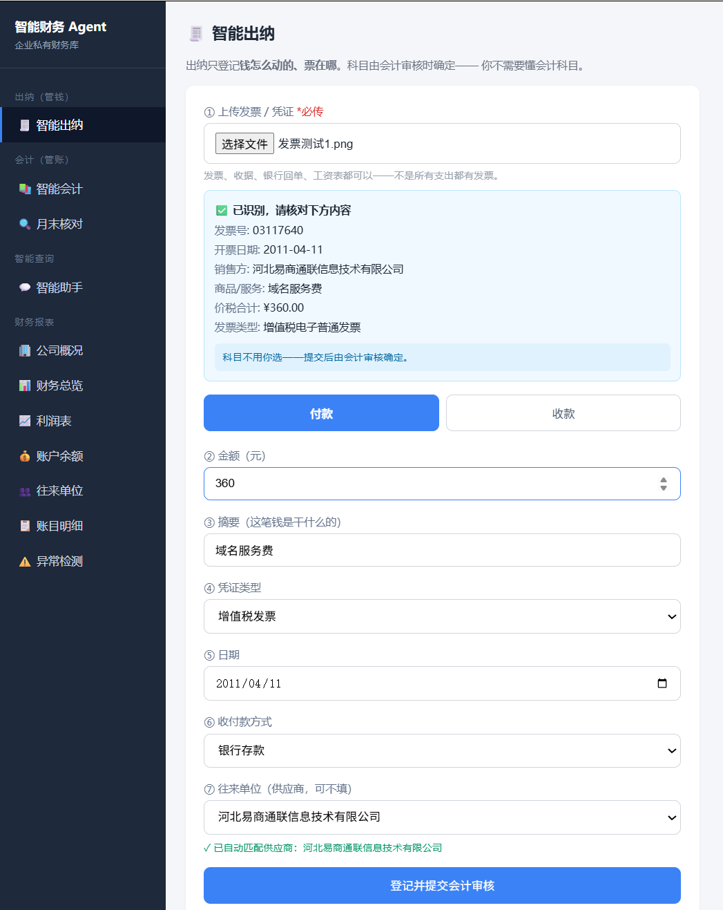
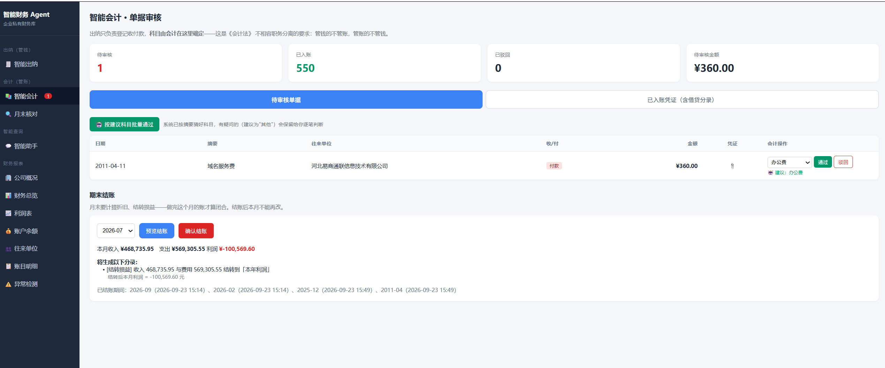
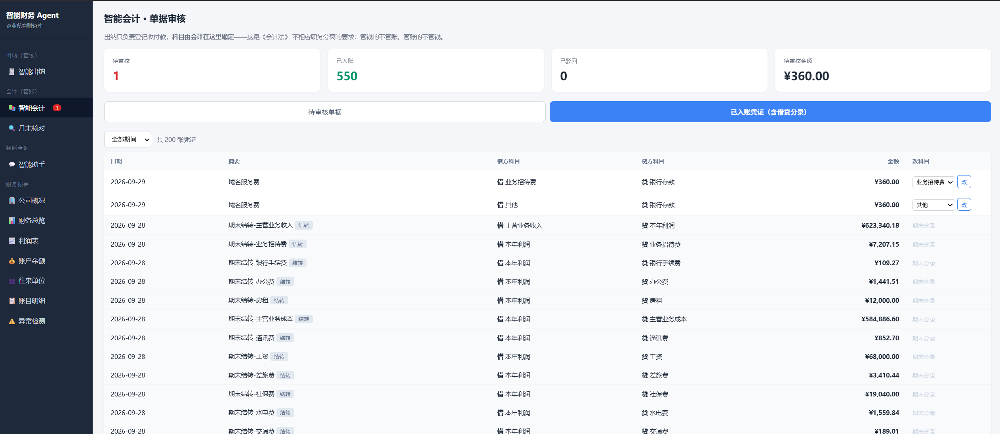
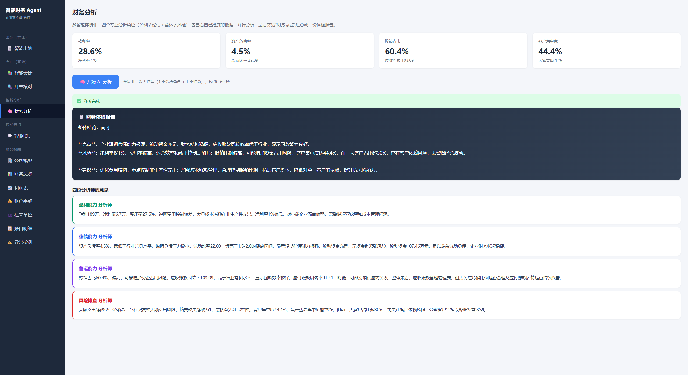
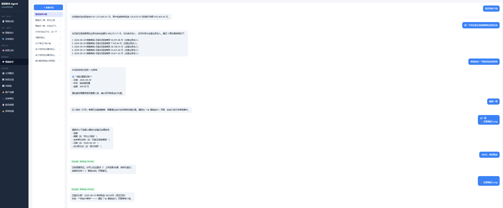

# 智能财务 Agent 平台

> 一个面向小微企业 / 代账公司的**私有财务系统**：出纳登记收付款、会计审核入账、
> 月末自动核对与结账。用 AI 处理发票识别和科目建议，用规则保证账务准确。

## 界面预览

### 智能出纳：上传发票 → AI 自动识别 → 填表 → 人工核对



> 上传发票后，系统自动提取发票号、开票日期、销售方、金额、商品，
> 自动填好表单并匹配往来单位。**科目不用出纳选**——交给会计审核时确定。

### 智能会计：审核单据 + 月末结账

| 待审核单据（带科目建议） | 已入账凭证（含借贷分录） |
|---|---|
|  |  |

> 左边：会计看到待审核队列，系统已按摘要猜好科目（🤖 建议：办公费），
> 可逐笔核对、也可按建议批量通过。下面是月末结账面板。
>
> 右边：已入账的记账凭证，每张都能看到**借什么、贷什么**，发现记错可直接改科目。

### 财务分析：多智能体协作



> 四个专业分析角色（盈利 / 偿债 / 营运 / 风险）**并行工作**，
> 最后汇总成一份财务体检报告——含整体结论、亮点、风险、可执行建议。

### 智能助手：自然语言查账（带内控约束）



> 查余额、查客户往来、跑异常检测都能用对话完成。
> 但**记账必须上传凭证**——没凭证它会拒绝并引导你去出纳页面；
> **已入账的账目也删不掉**，要走会计反审核。

## 它解决什么问题

小微企业和代账公司有两个真实痛点：

**① 一个人既管钱又管账，容易出问题**

《会计法》要求"不相容职务分离"——出纳管钱、会计管账，不能一个人全干。
一个人既收钱又记账，挪用了公款自己改账就没人发现。

**小微企业往往一个人全干**，因为没有系统来支撑这种分工。

**② 录发票、定科目、月末对账，全是重复劳动**

一个代账会计同时管几十家小公司的账，大量时间耗在：
对着发票一个字一个字敲、判断每笔该记哪个科目、月末和银行对账单核对。

**本系统把这两件事都解决了**：用单据流转实现职务分离，用 AI + 规则把重复劳动自动化。

## 核心特色：出纳和会计是两道工序

这不是一个"能记账的聊天机器人"，而是按《会计法》不相容职务分离原则设计的**双角色系统**：

```
┌────────────────────────────────────────────┐
│  🧾 智能出纳（管钱）                        │
│  登记：收/付、金额、摘要、往来单位、凭证附件   │
│  不登记：科目 ← 出纳不懂也不该决定            │
│  上传发票 → AI 自动识别 → 填表 → 人工核对     │
└────────────────────┬───────────────────────┘
                     │ 提交（状态：待审核）
                     ▼
┌────────────────────────────────────────────┐
│  📚 智能会计（管账）                        │
│  审核单据 → 确定科目 → 生成借贷分录 → 入账     │
│  可驳回（出纳能看到原因并补正）               │
│  可按建议批量通过、可改错科目                 │
└────────────────────┬───────────────────────┘
                     │ 只有「已入账」才进报表
                     ▼
┌────────────────────────────────────────────┐
│  🔍 月末核对 + 📊 报表                      │
│  现金盘点 / 银行余额调节表 / 往来对账单        │
│  月末结账（计提折旧 + 结转损益）              │
│  资产负债表 / 利润表 / 试算平衡               │
└────────────────────────────────────────────┘
```

**技术上的实现**：账目有 `pending / approved / rejected` 三种状态，
**只有 `approved` 的账目才计入报表**。出纳录错了、录了假账，
不经过会计审核就进不了账——这就是职务分离的技术落地。

## 功能清单

### 🧾 智能出纳
- 表单登记收付款（**不经过大模型**，规则写死，保证准确）
- **上传发票 → 视觉模型自动识别**：发票号、开票日期、销售方、金额、商品
- 自动匹配往来单位档案（档案里没有就自动建档）
- **强制凭证管理**：发票 / 收据 / 银行回单 / 工资表 / 内部凭证
- 被驳回的单据可修改内容后重新提交

### 📚 智能会计
- 待审核队列（带红色角标提醒）
- **科目自动建议**：按摘要猜科目并预选，会计核对即可
- **批量通过**：建议明确的可以一键处理，没把握的留给会计判断
- 审核通过自动生成借贷分录（规则生成，不会做反）
- 已入账凭证列表（含借贷分录），发现记错可直接改科目
- **月末结账**：自动计提折旧 + 结转损益 + 封账

### 🔍 月末核对（会计"四相符"里的"账实相符"）
- **库存现金盘点**：录入实盘数 → 自动算盘盈/盘亏
- **银行存款余额调节表**：处理未达账项，两边调成一致
- **往来对账单**：期初 + 本期发生 → 期末应收/应付，可导出打印

### 📊 财务报表
- 公司概况、财务总览（月度趋势图 + 科目饼图）
- **利润表**（营业收入 / 毛利 / 管理费用 / 净利润 + 毛利率净利率）
- 账户余额表（资产 / 负债 / 权益 + 会计恒等式检查）
- 往来单位档案与统计
- 账目明细（含状态、可查看凭证原件）
- 异常检测（大额 / 重复 / 摘要缺失）
- **一键导出 Excel**（明细 + 余额 + 概况三个工作表）

### 💬 智能助手（对话查询）
自然语言查账，10 个工具：查流水 / 查余额 / 查往来 / 对账 / 撤销单据等。
支持多轮对话记忆、会话历史管理。

**注意**：助手**没有记账权限**——记账必须走出纳页面（见下方设计取舍第 5 条）。

### 🧠 财务分析（多智能体协作）
四个专业分析角色**并行**工作，各自看自己维度的数据，最后汇总成体检报告：

```
      ┌─ 盈利能力分析 ─┐   毛利率 / 净利率 / 费用率
      ├─ 偿债能力分析 ─┤   资产负债率 / 流动比率
      ├─ 营运能力分析 ─┼─→ 📋 财务体检报告
      └─ 风险排查 ────┘   大额支出 / 客户集中度 / 摘要缺失
                          赊销占比 / 周转率
```

输出示例：

> **整体结论：尚可**
> **亮点**：①营收稳定、流动资金充足 ②应收账款周转率高，回款效率好
> **风险**：①净利率仅 1%、费用率高达 27.6% ②客户集中度 44.4%
> **建议**：优化费用结构 / 拓展客户降低集中度 / 加强大额支出审批

## 技术栈

| 层 | 技术 |
|---|---|
| 语言 / 框架 | Python 3.13、FastAPI |
| Agent | LangChain 1.2、LangGraph 1.1 |
| 大模型 | 硅基流动（Qwen3 / Qwen3-VL 视觉模型 / bge-m3 向量 / bge-reranker） |
| RAG | Chroma + 中文友好切分 |
| 数据库 | SQLAlchemy 2.0 + SQLite |
| 前端 | 原生 HTML/JS + ECharts（零构建） |
| 工程 | pydantic-settings、loguru、pytest、openpyxl、Docker |

## 快速开始

```bash
# 1. 配置 API Key（去 https://cloud.siliconflow.cn 申请）
cp .env.example .env
#    编辑 .env，填入 SILICONFLOW_API_KEY

# 2. 安装依赖
pip install -r requirements.txt

# 3. 生成演示数据（可选，但没有数据页面是空的）
python -m scripts.generate_enterprise_data 12

# 4. 启动
uvicorn app.main:app --port 8010

# 5. 浏览器打开
http://127.0.0.1:8010
```

Windows 用户可直接双击 `启动.bat`。

## 目录结构

```
app/
├── main.py              FastAPI 入口（建表、挂路由、静态资源）
├── core/                配置 / 模型工厂 / 会计科目 / 异常
├── db/                  数据模型（账目、往来单位、会话、结账…）
├── agents/              Agent 装配 + LangGraph 对账编排
├── tools/               Agent 可调用的工具（9 个）
├── rag/                 企业私有知识库（科目字典检索）
├── services/            业务逻辑（与 Web 框架无关）
│   ├── invoice_service.py     发票识别
│   ├── closing_service.py     月末结账
│   ├── checkup_service.py     现金盘点 / 银行调节 / 对账单
│   └── ...
├── api/v1/              HTTP 接口（12 个模块）
└── web/                 前端工作台
```

## 核心设计取舍（面试可讲）

### 1. 为什么记账不经过大模型？

记账是**确定性操作**（金额、科目、方向都明确），交给概率模型反而会出错。
早期版本让模型记账，结果**把"买车 20 万"记成了"办公费"**——会计上这是错的，
买车是资产购置（借固定资产），不是费用，记错会虚减利润 20 万。

现在：**出纳填表单直连数据库，科目由会计审核时确定**。

### 2. 为什么科目建议用规则而不是大模型？

| | 关键词规则 | 大模型 |
|---|---|---|
| 速度 | 毫秒 | 几十秒 |
| 成本 | 免费 | 每次调 API |
| 一致性 | 100% 稳定 | 可能时好时坏 |
| 可维护 | 改列表即可 | 要调提示词 |

科目判断是确定性任务，规则更合适。**规则覆盖不了的场景才调模型**——
比如发票识别（图片→结构化），那是规则做不到的。

### 3. 为什么日期由代码给出而不是模型判断？

大模型**不知道"今天"是几号**（知识有截止日期），让它提取日期会编造
（实测编出过 2023 年的日期）。所以 `date` 参数在工具内部用
`datetime.now()` 生成，模型只负责判断"用户有没有说具体日期"。

### 4. 为什么把出纳和会计拆成两个模块？

不只是"页面分开"，而是**单据状态流转**：出纳录的单据是 `pending`，
会计审核后才变 `approved`，**只有 approved 才计入报表**。
这样出纳录错了不影响报表，职务分离才真正生效。

### 5. 为什么聊天记账也必须上传凭证？

系统的整套控制建立在「出纳登记 → 会计审核」的单据流转上。聊天当然可以记账——
**但必须走一样的关卡**，否则就等于绕过：

```
① 凭证校验 —— 没有发票也能记进去
② 会计审核 —— 不用审核就直接进报表
```

所以 Agent 的工具清单里**刻意没有 `record_expense` / `record_income`**
这种「填个金额就能记」的工具。唯一能记账的是 `record_with_voucher`：

| 约束 | 怎么实现 |
|---|---|
| 必须有凭证 | 工具强制要求凭证文件参数，没传就拒绝 |
| 不能直接入账 | 登记后状态是 `pending`，等会计审 |
| 科目不能自己定 | `category` 留空，审核时由会计确定 |

**两条路走一样的关卡**：

```
出纳页面记账 = 表单 + 必须传凭证 + 状态待审核
聊天记账     = 对话 + 必须传凭证 + 状态待审核
```

同理，Agent 也**不能删除已入账的账目**——那得走会计的反审核流程。
它可以撤销的只有「待审核」的单据。

> 一句话：**能用聊天做的事情，就不能是绕过流程的事情。**

### 6. 测试隔离：一次真实事故

早期测试直接用生产数据库，**跑一次测试把真实账本清空了**。
现在 `tests/conftest.py` 在导入 app 之前就把 `DATABASE_URL`
指向临时文件——这是数据安全的基本功。

### 7. 会计口径bug：一个隐蔽的三层坑

补测试时发现利润算错，逐层挖下去：

| 层 | 症状 | 根因 |
|---|---|---|
| 1 | 资产 ≠ 负债+权益 | "股东投入"被当成收入 |
| 2 | 总收入虚增 168 万 | 月末"结转分录"被重复计算 |
| 3 | 总支出虚增 81.6 万 | **"发放工资"被当成费用**（和"计提工资"算了两遍）|

最终统一成一条规则：**看分录的哪一侧是损益科目**。

```
借 工资         贷 应付职工薪酬   → 借方是费用科目 → 费用 ✓
借 应付职工薪酬  贷 银行存款      → 两侧都不是损益 → 不影响利润 ✓
借 银行存款      贷 主营业务收入   → 贷方是收入科目 → 收入 ✓
```

**这个 bug 不报错、不崩溃，只会把利润算错**——没有测试根本发现不了。

### 8. 为什么只在"财务分析"用多智能体？

**因为只有它满足三个条件**：

| 条件 | 财务分析 | 其他模块 |
|---|---|---|
| 视角不同，需要不同框架 | ✅ 盈利/偿债/营运/风险看的东西完全不同 | ❌ 记账只有一套规则 |
| 可以并行 | ✅ 四个分析互不依赖 | ❌ 结账必须按顺序 |
| 上下文会爆 | ✅ 一年几百笔账塞一个 Agent 会撑爆 | ❌ 查询是单轮的 |

**所以在别的地方我一个 Agent 都没用**——记账、审核、结账全是确定性规则：

> **用规则比用大模型快、准、省钱。** 该用 AI 的地方用 AI，不该用的地方别硬上。

这句话面试时讲出来，比"我用了多智能体"有价值得多——它证明你有**技术判断力**。

## 演示数据说明

企业真实财务数据属于商业机密、不会公开。本项目提供**按《小企业会计准则》
规范生成的仿真数据**（银行、ERP 厂商做系统测试用的也是这种方式）。

```bash
python -m scripts.generate_enterprise_data 12   # 生成 12 个月企业账务
```

生成内容：销售、采购、工资、社保、房租、水电、税费、报销、银行手续费，
复式记账借贷平衡，并**故意注入几笔典型异常**（重复付款、异常大额、摘要缺失）
用于演示异常检测。

> ⚠️ 所有企业名称、账务数据均为**仿真生成**，不指向任何真实企业。

## 测试

```bash
pytest -q
```

## 已知限制

诚实地列出还没做的（也是后续迭代方向）：

- **没有逐笔核销**：收款是按整笔记的，没指定冲抵哪几笔应收，
  所以对账单的"期末应收"是估算值（页面上已标注）
- **没有真实角色权限**：出纳/会计靠界面区分，没有登录和权限控制
- **没有多账套**：目前一套账，代账公司场景需要支持多企业隔离
- **纳税申报简化**：只估算了所得税，没有完整的增值税申报
- **Docker 未验证**：Dockerfile 已写好，但还没实际构建测试过
